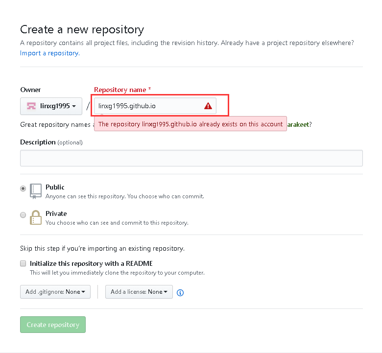

updated:2020/04/13

以前不写博客总结，觉得是自己的一个弱项，所以想提升自己，养成一个好习惯。
第一篇就记 用Hexo快速搭建github.io的个人博客。
<!-- Welcome to [Hexo](https://hexo.io/)! This is your very first post. Check [documentation](https://hexo.io/docs/) for more info. If you get any problems when using Hexo, you can find the answer in [troubleshooting](https://hexo.io/docs/troubleshooting.html) or you can ask me on [GitHub](https://github.com/hexojs/hexo/issues). -->

## 一、开发环境
    系统        Win10
    编辑器      VSCode
    核心框架    hexo

## 二、开始搭建

### 安装 hexo
``` bash
$ npm install -g hexo-cli
```
### 创建hexo工程
在自己的工作区中新建一个工程文件夹，打开终端cmd进入到该工程的根目录，执行hexo初始化：
``` bash
\vscode-workspace\linxgblog>$ hexo init
```
初始化会生成工程默认需要的目录结构，然后需要安装默认需要的依赖，并且安装 hexo-deployer-git 插件，提供便捷的部署hexo工程到git上的操作。
``` bash
$ npm i
$ npm i hexo-deployer-git -S
```
### 创建git远程仓库
每个git账号都可以白嫖一个用于展示个人博客的静态网站，且仓库名固定，如下图(图中的警告提示是因为我已经创建了)。
``` bash
<git_username>.github.io
```


More info: [Writing](https://hexo.io/docs/writing.html)

### Run server

``` bash
$ hexo server
```

More info: [Server](https://hexo.io/docs/server.html)

### Generate static files

``` bash
$ hexo generate
```

More info: [Generating](https://hexo.io/docs/generating.html)

### Deploy to remote sites

``` bash
$ hexo deploy
```

More info: [Deployment](https://hexo.io/docs/one-command-deployment.html)
