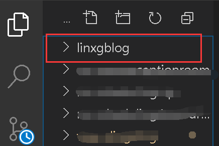
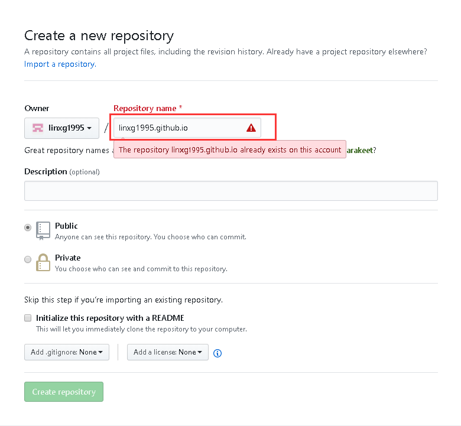
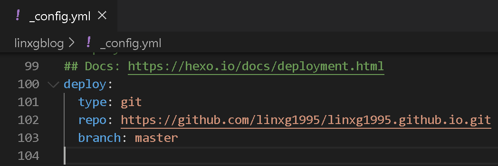
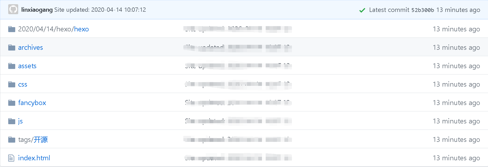

updated:2020/04/13

以前不写博客总结，觉得是自己的一个弱项，所以想提升自己，养成一个好习惯。
第一篇就记 用Hexo快速搭建github.io的个人博客。
<!-- Welcome to [Hexo](https://hexo.io/)! This is your very first post. Check [documentation](https://hexo.io/docs/) for more info. If you get any problems when using Hexo, you can find the answer in [troubleshooting](https://hexo.io/docs/troubleshooting.html) or you can ask me on [GitHub](https://github.com/hexojs/hexo/issues). -->

## 一、开发环境
``` bash
系统：Win10
编辑器：VSCode
核心框架：Hexo
```
[Hexo](https://hexo.io/zh-cn/)是一个开源的博客框架，能快速的搭建静态博客网站并部署到github或其它平台，默认支持Markdown。
<!-- --------------------分割线-------------------- -->
## 二、开始搭建

### 安装 hexo
``` bash
$ npm install -g hexo-cli
```

### 创建hexo工程
在自己的工作区中新建一个工程文件夹，打开终端cmd进入到该工程的根目录，执行hexo初始化：

``` bash
\linxgblog>$ hexo init
```
初始化会生成工程默认需要的目录结构，然后需要安装默认需要的依赖；安装 hexo-deployer-git 插件，提供便捷的部署hexo工程到git上的操作。
至此工程创建完成，本地运行一下试试。
``` bash
$ npm i
$ npm i hexo-deployer-git -S
$
$ hexo s  # hexo server
# http://localhost:4000
```

### 创建git远程仓库
每个git账号都可以白嫖一个用于展示个人博客的静态网站，且仓库名固定，如下图(图中的警告提示是因为我已经创建了)。
``` bash
<git_username>.github.io
```


### 部署
仓库创建完成后，得到仓库地址URL，修改配置文件 /_config.yml 相关的配置。
``` yml
deploy:
    type: git
    repo: <repository_url>  # git远程仓库地址
    branch: <branch_name>  # 分支名，一般是master
```

将工程推到git上。
``` bash
$ hexo clean  # 清除缓存
$ hexo deploy  # 部署
```
我们会注意到，执行hexo的deploy部署命令推到git上时，目录结构跟本地工程的不同，也就是编译过。

为了便于维护，可以再建一个git远程仓库，执行git命令把工程推上去，用来管理工程源代码。

至此，基于Hexo搭建的github.io个人博客 搭建完成，更多的配置和自定义操作，参考[Hexo官方文档](https://hexo.io/zh-cn/docs/)和[Markdown](https://www.runoob.com/markdown/md-tutorial.html)进行学习。


<!-- More info: [Writing](https://hexo.io/docs/writing.html)

### Run server

``` bash
$ hexo server
```

More info: [Server](https://hexo.io/docs/server.html)

### Generate static files

``` bash
$ hexo generate
```

More info: [Generating](https://hexo.io/docs/generating.html)

### Deploy to remote sites

``` bash
$ hexo deploy
```

More info: [Deployment](https://hexo.io/docs/one-command-deployment.html) -->
